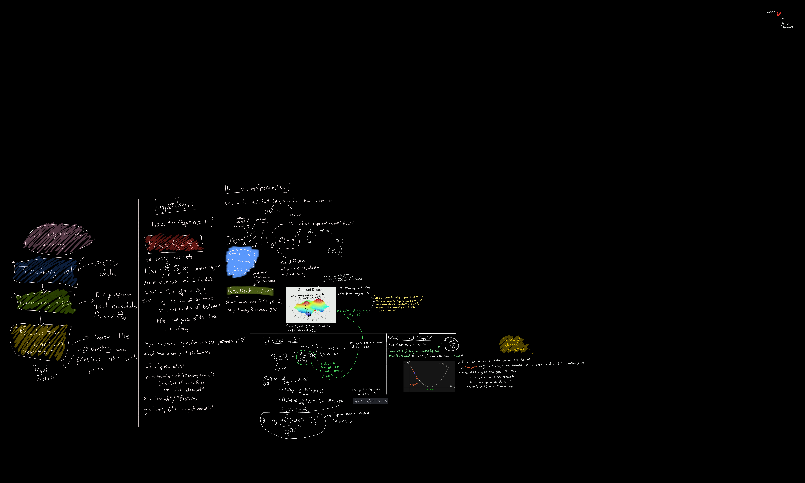
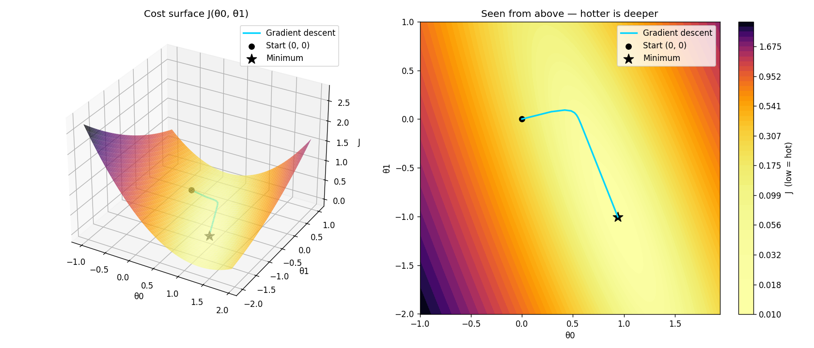
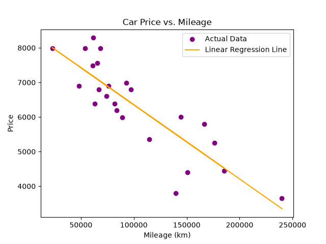

# ft_linear_regression

*An introduction to machine learning: predicting the price of a car from its mileage using a univariate linear model trained by batch gradient descent.*

---

## Abstract

This project implements, from first principles and without any machine-learning library, a **univariate linear regression** model. Given a dataset of second-hand cars described by a single feature — mileage, in kilometres — the program learns the two parameters of an affine hypothesis function that minimise the mean squared error between predicted and observed prices. Learning is performed by **batch gradient descent** on min–max normalised data; the resulting parameters are serialised and reused by an independent prediction program. A third program evaluates the quality of the fit using the coefficient of determination (R²) and the mean absolute error (MAE).

The pedagogical objective is not predictive performance but *mechanistic understanding*: every component of the learning pipeline — the hypothesis, the cost function, the analytical derivation of its gradient, the update rule, and the role of feature scaling — is written explicitly.

---

## 1. Problem statement

Let the training set be a collection of $m$ observations

$$\{(x^{(i)}, y^{(i)})\}_{i=1}^{m}, \qquad x^{(i)} \in \mathbb{R}\ \text{(mileage, km)},\quad y^{(i)} \in \mathbb{R}\ \text{(price)}$$

The dataset used here (`data.csv`) contains **24 cars**, with mileages ranging from 22 899 km to 240 000 km and prices from 3 650 to 8 290 currency units. Visual inspection reveals a clear negative monotonic relationship: price decreases as mileage accumulates. The task is therefore a **supervised regression** problem — the target variable is continuous and each training example is labelled.

---

## 2. Theoretical framework

The derivation that underpins the implementation is reproduced below in its worked-out form: hypothesis, cost function, the geometric intuition of gradient descent, and the differentiation of the cost with respect to each parameter.



### 2.1 Hypothesis

The model is affine in the single input feature:

$$h_\theta(x) = \theta_0 + \theta_1 x$$

where $\theta_0$ is the intercept (the price of a hypothetical zero-mileage car) and $\theta_1$ is the slope (the marginal depreciation per kilometre). In the code this is `estimatePrice(mileage, theta0, theta1)`.

### 2.2 Cost function

Model quality is quantified by the **half mean squared error**:

$$J(\theta_0, \theta_1) = \frac{1}{2m} \sum_{i=1}^{m} \left( h_\theta(x^{(i)}) - y^{(i)} \right)^2$$

Squaring makes the cost insensitive to the *direction* of the error and penalises large deviations superlinearly; the factor $\tfrac{1}{2}$ is a conventional simplification that cancels the exponent when differentiating. $J$ is a convex quadratic form in $(\theta_0, \theta_1)$, which guarantees that any local minimum is the unique global minimum.

### 2.3 Gradient descent

Since no closed form is used here, the minimum is approached iteratively. Starting from $\theta_0 = \theta_1 = 0$, both parameters are repeatedly displaced against the gradient:

$$\theta_j := \theta_j - \alpha \frac{\partial}{\partial \theta_j} J(\theta_0, \theta_1)$$

Differentiating the cost yields the two partial derivatives implemented in `train.py`:

$$\frac{\partial J}{\partial \theta_0} = \frac{1}{m} \sum_{i=1}^{m} \left( h_\theta(x^{(i)}) - y^{(i)} \right)$$

$$\frac{\partial J}{\partial \theta_1} = \frac{1}{m} \sum_{i=1}^{m} \left( h_\theta(x^{(i)}) - y^{(i)} \right) x^{(i)}$$

Two properties of the update deserve emphasis:

1. **Simultaneity.** The residual vector is computed *once per epoch*, before either parameter is modified. Updating $\theta_0$ first and then recomputing the residuals for $\theta_1$ would evaluate the second gradient at a point the algorithm has already left, and the trajectory would no longer follow the true gradient of $J$.
2. **Batch nature.** Each step aggregates all $m$ examples, hence *batch* gradient descent, as opposed to stochastic or mini-batch variants.

The learning rate $\alpha$ governs the step length. Too small a value slows convergence; too large a value overshoots the minimum and causes the parameters to diverge (numerically, to `NaN`). Here $\alpha = 0.5$ over $10\,000$ epochs, a combination made safe by normalisation (§3).

### 2.4 The cost surface

Because $J$ is convex, its graph over the parameter plane is a paraboloid — a single valley with no spurious local minima. Gradient descent is, geometrically, a ball released on that surface and rolling downhill until the slope vanishes.



The left panel shows the surface $J(\theta_0, \theta_1)$; the right panel is the same surface seen from above, level curves shaded by cost. The trajectory begins at the origin, descends steeply along the direction of highest curvature, and then follows the floor of the valley towards the minimum, where the gradient — and therefore the parameter update — approaches zero.

---

## 3. Feature scaling

Raw mileages are of order $10^5$ while prices are of order $10^3$. This disparity of scale deforms the cost surface into a highly eccentric, narrow ravine: the gradient component associated with $\theta_1$ is inflated by the magnitude of $x$, so any learning rate small enough to keep $\theta_1$ stable makes $\theta_0$ converge imperceptibly slowly.

Both variables are therefore **min–max normalised** onto $[0, 1]$:

$$x' = \frac{x - x_{\min}}{x_{\max} - x_{\min}}$$

This restores a well-conditioned, near-circular cost surface on which a large learning rate is safe. The consequence is that the learned $\theta_0, \theta_1$ live in *normalised* space and are meaningless applied to raw kilometres. The training program therefore persists the four scaling bounds ($x_{\min}, x_{\max}, y_{\min}, y_{\max}$) alongside the parameters, and every consumer of the model must apply the same transformation to its input and the inverse transformation

$$y = y' \,(y_{\max} - y_{\min}) + y_{\min}$$

to its output. The degenerate case $x_{\max} = x_{\min}$ is guarded explicitly to avoid a division by zero.

---

## 4. Implementation

The codebase is deliberately small and layered, with all shared mathematics factored into a single module.

| File | Role |
| --- | --- |
| [utils.py](utils.py) | Shared primitives: dataset and parameter loading with error handling, `normalize`, `denormalize`, `estimatePrice`, terminal colour codes. |
| [train.py](train.py) | Loads the dataset, normalises it, runs gradient descent, serialises the parameters and scaling bounds to `thetas.json`, and renders the regression plot. |
| [predict.py](predict.py) | Reads the persisted model, prompts for a mileage, and returns the estimated price. Does *not* require the dataset. |
| [precision.py](precision.py) | Evaluates the trained model against the dataset and reports R² and MAE. |
| [data.csv](data.csv) | The training set: 24 (km, price) pairs. |
| `thetas.json` | Artefact produced by training; the interface between the two programs. |

The separation between `train.py` and `predict.py` is a requirement of the exercise and mirrors the standard distinction between the *fitting* phase (expensive, offline, data-dependent) and the *inference* phase (cheap, online, data-independent).

### 4.1 Defensive behaviour

- A missing `thetas.json` is **not** fatal for prediction: the program warns and falls back to $\theta_0 = \theta_1 = 0$, the untrained model, which by definition predicts zero — the behaviour prescribed by the subject.
- A corrupted or truncated `thetas.json`, a missing key, a missing or empty `data.csv`, and non-numeric user input are each reported explicitly rather than allowed to surface as a traceback.
- Negative predictions — an extrapolation artefact for mileages beyond the training range — are clamped to zero.
- `precision.py` refuses to report R² when the target variance is zero, since the ratio would be undefined; sums are computed with `skipna=False` so that a diverged model produces `NaN` rather than a silently optimistic score.

---

## 5. Usage

```bash
python3 train.py       # fit the model, write thetas.json, render regression_graph.png
python3 predict.py     # interactive: enter a mileage, obtain an estimated price
python3 precision.py   # report R² and MAE for the fitted model
```

Requires Python 3 with `pandas` and `matplotlib`.

---

## 6. Results

Training for $10\,000$ epochs at $\alpha = 0.5$ converges to

$$\theta_0 \approx 0.9393, \qquad \theta_1 \approx -1.0036 \quad \text{(normalised space)}$$

which, expressed in the original units, corresponds to

$$\widehat{\text{price}} \approx 8\,499.60 - 0.02145 \times \text{km}$$

that is, an estimated depreciation of roughly **21.4 currency units per 1 000 km**.



The fitted line captures the downward trend, while the residual spread reflects the price variation that mileage alone cannot explain — age, condition, model and options are all absent from the feature set.

### 6.1 Evaluation metrics

**Coefficient of determination.** R² expresses the fraction of the variance of the target that the model accounts for, relative to the trivial baseline that always predicts the mean:

$$R^2 = 1 - \frac{SS_{\text{res}}}{SS_{\text{tot}}} = 1 - \frac{\sum_i (y^{(i)} - \hat{y}^{(i)})^2}{\sum_i (y^{(i)} - \bar{y})^2}$$

A value of $1$ denotes perfect prediction, $0$ denotes a model no better than the mean, and negative values denote a model worse than the mean.

**Mean absolute error.** MAE reports the average magnitude of the residuals in the unit of the target, which makes it directly interpretable:

$$\text{MAE} = \frac{1}{m}\sum_{i=1}^{m} \left| y^{(i)} - \hat{y}^{(i)} \right|$$

| Metric | Value |
| --- | --- |
| Cars evaluated | 24 |
| R² | 0.7330 (73.30 %) |
| MAE | 557.84 |

Mileage alone therefore explains about **73 %** of the observed price variance, with a typical error of some 558 units. For a single-feature model on 24 observations this is a reasonable fit; the remaining 27 % is the ceiling imposed by the choice of feature, not by the optimiser.

---

## 7. Limitations

- **Univariate.** A single explanatory variable cannot represent a phenomenon that is genuinely multi-causal.
- **Linearity.** Depreciation is empirically closer to exponential than linear; the affine hypothesis systematically misprices the extremes of the mileage range.
- **Sample size.** With $m = 24$ and no held-out test set, the reported R² is a measure of *fit*, not of generalisation.
- **Extrapolation.** Outside $[x_{\min}, x_{\max}]$ the model is unconstrained, which is precisely why negative outputs must be clamped.

---

## 8. References

- Andrew Ng, *Machine Learning* — linear regression with one variable, gradient descent, feature scaling.
- 42 School, *ft_linear_regression* subject.
